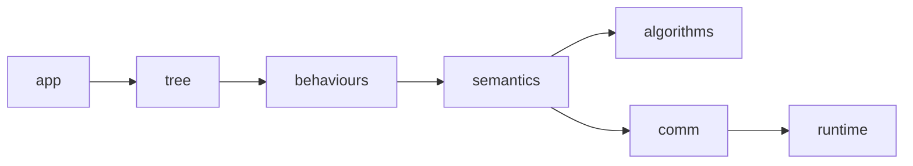

# Marathon 业务通信分层隔离执行方案

## 1. 目标

本方案只覆盖一个范围：

- `BT` 叶节点触发的业务 `ROS` 通信

已确认决策：

1. 接受一次性物理移动文件到新目录结构
2. 业务输入事件名统一使用 `ros_in`，不再继续使用 `ros_topic_received` 作为目标命名
3. 删除 `ManagerProxy` 这条最终业务日志路径；业务通信最终日志只允许由 `Generic ROS Facade` 生成

本方案不覆盖：

- `tree_publisher.py`
- `bb_ros_bridge.py`
- `bt_exec_controller.py`
- `marathon_bt_node.py` 中的启动/关机固定动作
- callback 入站接收之外的 node 基础设施通信

目标结果：

1. 所有业务 `ROS` 出站通信必须经过 `Generic ROS Facade`
2. `Project Semantic Facade` 负责业务语义翻译，不直接发 `ROS`
3. 用文件路径隔离约束层级
4. 用 import 规范和 `CI` 检查把约束落地
5. 所有业务通信日志只允许由 `Generic ROS Facade` 生成

---

## 2. 目标分层



含义：

- `app`：组装入口
- `tree`：树结构
- `behaviours`：叶节点
- `semantics`：项目语义层
- `algorithms`：纯算法组件
- `comm`：业务通信统一出口
- `runtime`：真实 `ROS` runtime / manager / publisher

---

## 3. 路径隔离方案

建议把 `marathon` 目录重组为：

```text
ainex_xyz-master/docker/ros_ws_src/ainex_behavior/marathon/
├── app/
│   └── marathon_bt_node.py
├── tree/
│   └── marathon_bt.py
├── behaviours/
│   ├── actions.py
│   └── conditions.py
├── semantics/
│   └── semantic_facade.py
├── comm/
│   └── comm_facade.py
├── algorithms/
│   └── visual_patrol.py
├── infra/
│   ├── bt_exec_controller.py
│   ├── tree_publisher.py
│   └── bb_ros_bridge.py
└── log/
```

说明：

- `infra/` 保留为平行层，不并入业务通信链
- `bt_observability/` 保持原目录，不放进 `marathon/` 层级链
- `runtime` 仍然来自 `Common`、`GaitManager`、`MotionManager` 等现有包，不移动

---

## 4. 每层职责与允许依赖

## 4.1 `app/`

文件：

- `marathon/app/marathon_bt_node.py`

职责：

- `rospy.init_node`
- `Common` 初始化
- live/latched 输入管理
- subscriber callback
- logger 初始化
- 组装 `semantic_facade`
- 组装 `comm_facade`
- 组装 tree

允许 import：

- `tree.*`
- `behaviours.*`
- `semantics.*`
- `comm.*`
- `algorithms.*`
- `infra.*`
- `bt_observability.*`
- `rospy`、ROS msg/srv
- `Common`、底层 runtime

禁止行为：

- 不写业务算法
- 不在这里生成业务 `ros_out/ros_result`
- 不把 manager 直接注入 leaf

豁免项：

- 启动/关机固定动作可以保留在这里
- callback 入站日志可以保留在这里

## 4.2 `tree/`

文件：

- `marathon/tree/marathon_bt.py`

职责：

- 只拼 `Sequence / Selector / Decorator / Parallel`
- 注入 leaf 依赖

允许 import：

- `py_trees`
- `behaviours.*`

禁止 import：

- `rospy`
- `comm.*`
- `algorithms.*`
- runtime manager
- logger 直接出站记录接口

## 4.3 `behaviours/`

文件：

- `marathon/behaviours/actions.py`
- `marathon/behaviours/conditions.py`

职责：

- `conditions.py`：读 `/latched/*`，输出状态
- `actions.py`：表达业务意图

允许 import：

- `py_trees`
- `rospy`，仅允许 `loginfo/logwarn/logdebug`
- `semantics.*`

禁止 import：

- `comm.*`
- `algorithms.*`
- runtime manager
- `rospy.Publisher`
- `rospy.Subscriber`
- `rospy.ServiceProxy`
- `bt_observability.debug_event_logger`
- `bt_observability.ros_comm_tracer`

硬规则：

- `actions.py` 只能调用 `semantic_facade.*`
- `conditions.py` 不能触发任何 `ROS` 通信

## 4.4 `semantics/`

文件：

- `marathon/semantics/semantic_facade.py`

职责：

- 将 leaf 的业务意图翻译为项目语义动作
- 组织算法组件
- 把业务动作映射到 `Generic ROS Facade`

允许 import：

- `algorithms.*`
- `comm.*`
- `rospy`，仅允许控制台日志
- 项目常量/配置模块

禁止 import：

- runtime manager
- `rospy.Publisher`
- `rospy.Subscriber`
- `rospy.ServiceProxy`
- `DebugEventLogger.emit_comm`
- `ManagerProxy`

硬规则：

- `semantic_facade.py` 只能向下调用 `comm_facade.py`
- 不允许直接发 `ROS`
- 不允许直接生成业务通信日志

## 4.5 `algorithms/`

文件：

- `marathon/algorithms/visual_patrol.py`

职责：

- 纯算法计算
- 输出结构化控制结果

允许 import：

- `math`
- `ainex_sdk.misc`
- 只读配置/工具模块

禁止 import：

- `rospy`
- runtime manager
- `comm.*`
- `bt_observability.*`

硬规则：

- 不允许任何 `ROS` 副作用
- 不允许写日志事件

## 4.6 `comm/`

文件：

- `marathon/comm/comm_facade.py`

职责：

- 唯一业务 `ROS` 出站执行层
- 唯一业务通信最终日志出口

允许 import：

- `rospy`
- ROS msg/srv
- runtime manager / publisher
- `bt_observability.debug_event_logger`

禁止 import：

- `tree.*`
- `behaviours.*`
- `algorithms.*`

硬规则：

- 所有业务 `ros_out/ros_result` 只能在这里生成
- 不允许再依赖 `ManagerProxy` 代写最终日志
- 每个出站方法必须在这里完成：
  - 实际调用
  - payload 裁剪
  - 统一 schema 输出

## 4.7 `infra/`

文件：

- `marathon/infra/bt_exec_controller.py`
- `marathon/infra/tree_publisher.py`
- `marathon/infra/bb_ros_bridge.py`

职责：

- 非业务 BT 基础设施通信

说明：

- 这层不属于 `Generic ROS Facade`
- 这层不允许被 `behaviours/` 或 `semantics/` 直接依赖

---

## 5. 日志归属硬规范

## 5.1 业务通信日志

只能由：

- `marathon/comm/comm_facade.py`

生成事件：

- `ros_out`
- `ros_result`

禁止生成位置：

- `actions.py`
- `conditions.py`
- `semantic_facade.py`
- `visual_patrol.py`

## 5.2 BT 生命周期日志

只能由：

- `bt_observability/bt_debug_visitor.py`

生成事件：

- `tree_tick_start`
- `tree_tick_end`
- `tick_end`
- `decision`
- `bb_write`

## 5.3 输入适配日志

可以保留在：

- `marathon/app/marathon_bt_node.py`

生成事件：

- `ros_in`

说明：

- `/imu`
- `/object/pixel_coords`

属于业务输入适配日志，不属于 `Generic ROS Facade` 出站日志。

命名要求：

- 将当前 `ros_topic_received` 统一收敛为 `ros_in`
- 输入日志字段风格与 `ros_out/ros_result` 对齐

---

## 6. `Generic ROS Facade` 完整实现要求

当前 `CommFacade` 还不算完整版本。完整版本必须满足：

1. `disable_gait`
2. `enable_gait`
3. `set_step`
4. `run_action`
5. `set_servos_position`
6. `publish_buzzer`

以上每个方法都必须：

- 自己调用 runtime
- 自己写最终日志
- 不依赖 `ManagerProxy` 生成最终业务日志

实现约束：

- 删除 `ManagerProxy` 在业务通信主链中的使用
- `marathon_bt_node.py` 不再构造 `_gait_proxy`、`_motion_proxy`
- `comm_facade.py` 直接持有真实 runtime 对象
- 所有业务 payload 裁剪逻辑迁移到 `comm_facade.py`

统一日志字段至少包含：

```json
{
  "event": "ros_out",
  "ts": 0,
  "tick_id": 0,
  "phase": "tick",
  "bt_node": "FollowLine",
  "ros_node": "marathon_bt",
  "semantic_source": "follow_line",
  "target": "/walking/set_param",
  "comm_type": "topic_publish",
  "direction": "out",
  "payload": {},
  "summary": "",
  "attribution_confidence": "high"
}
```

过渡期可以兼容旧字段：

- `node`
- `source`

但新字段必须是主字段。

---

## 7. import 规范

## 7.1 允许的依赖方向

只允许以下方向：

- `app -> tree`
- `app -> behaviours`
- `app -> semantics`
- `app -> comm`
- `app -> algorithms`
- `app -> infra`
- `tree -> behaviours`
- `behaviours -> semantics`
- `semantics -> algorithms`
- `semantics -> comm`
- `comm -> runtime`

禁止反向依赖：

- `comm -> semantics`
- `comm -> behaviours`
- `semantics -> behaviours`
- `algorithms -> semantics`
- `infra -> behaviours`

## 7.2 目录级禁止项

### `behaviours/` 禁止：

- `from ..comm`
- `from marathon.comm`
- `gait_manager`
- `motion_manager`
- `rospy.Publisher`
- `rospy.ServiceProxy`
- `emit_comm(`

### `semantics/` 禁止：

- `gait_manager`
- `motion_manager`
- `rospy.Publisher`
- `rospy.ServiceProxy`
- `emit_comm(`
- `ManagerProxy`

### `algorithms/` 禁止：

- `rospy`
- `publish(`
- `set_step(`
- `run_action(`
- `set_servos_position(`
- `emit_comm(`

### `tree/` 禁止：

- `rospy`
- `CommFacade`
- `GaitManager`
- `MotionManager`

---

## 8. CI 检查规则

第一阶段先用 `rg` 脚本检查，足够直接。

## 8.1 `behaviours/` 检查

```bash
rg -n "Publisher\\(|ServiceProxy\\(|emit_comm\\(|gait_manager|motion_manager|ManagerProxy|from .*comm|import .*comm" marathon/behaviours
```

期望结果：

- 无匹配

## 8.2 `conditions.py` 单独检查

```bash
rg -n "semantic_facade|CommFacade|Publisher\\(|ServiceProxy\\(|emit_comm\\(" marathon/behaviours/conditions.py
```

期望结果：

- 无匹配

## 8.3 `semantics/` 检查

```bash
rg -n "Publisher\\(|ServiceProxy\\(|emit_comm\\(|ManagerProxy|gait_manager|motion_manager" marathon/semantics
```

期望结果：

- 无匹配

## 8.4 `algorithms/` 检查

```bash
rg -n "rospy|publish\\(|set_step\\(|run_action\\(|set_servos_position\\(|emit_comm\\(" marathon/algorithms
```

期望结果：

- 无匹配

## 8.5 `tree/` 检查

```bash
rg -n "rospy|CommFacade|GaitManager|MotionManager|Publisher\\(|ServiceProxy\\(" marathon/tree
```

期望结果：

- 无匹配

## 8.6 `comm/` 检查

```bash
rg -n "from .*behaviours|from .*semantics|from .*algorithms" marathon/comm
```

期望结果：

- 无匹配

## 8.7 业务通信日志唯一出口检查

```bash
rg -n "emit_comm\\(" marathon
```

人工验收要求：

- 业务 `ros_out/ros_result` 只应出现在 `comm/comm_facade.py`
- `app/marathon_bt_node.py` 允许保留 `ros_in`
- `infra/` 不在此规则范围内

---

## 9. 分阶段实施计划

### Phase 1：目录重组

1. 新建：
   - `app/`
   - `tree/`
   - `semantics/`
   - `comm/`
   - `algorithms/`
   - `infra/`
2. 移动对应文件
3. 修正 import 路径

验收：

- 代码能被解释器正常 import
- `tree.setup(timeout=5)` 正常

### Phase 2：去除越层依赖

1. `actions.py` 只保留 `semantic_facade`
2. `semantic_facade.py` 去掉所有 runtime 直接调用
3. `visual_patrol.py` 保持纯算法
4. `tree/` 去除 runtime 认知

验收：

- 通过第 8 节静态检查

### Phase 3：补全 `Generic ROS Facade`

1. 让 `comm_facade.py` 自己生成所有业务出站日志
2. 删除 `ManagerProxy` 在业务主链中的使用
3. 保持 `bt_node`、`semantic_source`、`summary` 等新字段统一输出

验收：

- 最近一次 comm 日志中，业务出站事件全部带：
  - `bt_node`
  - `semantic_source`
  - `summary`
- 不再依赖 `source` 作为主字段
- 业务路径中不再 import `ManagerProxy`

### Phase 4：CI 固化

1. 把第 8 节脚本接进本地检查或 `CI`
2. 把违规匹配视为失败

验收：

- 新增越层 import 会导致检查失败

---

## 10. 风险

1. 目录迁移会影响 import 路径和 rosrun 启动方式
2. `CommFacade` 去掉 `ManagerProxy` 代写日志后，要自己补全 payload 裁剪逻辑
3. 当前 `app` 层仍有 callback 入站日志和固定生命周期动作，不能误并入业务 facade 范围

---

## 11. 已确认收口项

1. 目录重组采用一次性物理移动文件
2. 业务输入日志事件名统一为 `ros_in`
3. 删除 `ManagerProxy` 在业务主链中的功能，不保留为过渡实现
