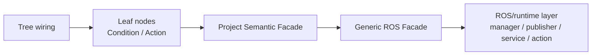
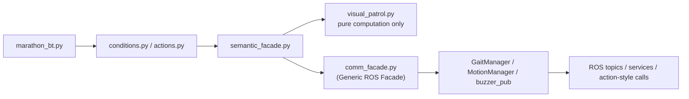

# Marathon 执行设计方案：Project Semantic Facade + Generic ROS Facade

## 0. 已确认决策

本方案基于以下已确认选择，不再作为开放问题处理：

1. `visual_patrol` 采用后者方案，改为纯算法组件，只负责计算控制量，不直接发 ROS 命令
2. 保留 `Common` 及现有底层 manager 初始化方式，不在本次重构中一起改动
3. 最终日志采用新规范字段，以 `bt_node`、`semantic_source` 等字段为主，不再以旧式 `node`、`source` 为主要标准

## 1. 目标

将当前 `marathon` BT 项目重构为以下架构：

- `Tree wiring` 只负责拼树
- `Leaf nodes` 只负责表达业务意图
- `Project Semantic Facade` 负责将 leaf 的业务意图翻译为项目内动作语义
- `Generic ROS Facade` 负责统一 ROS 通信出口与最终日志记录
- `ROS/runtime layer` 负责真实执行 ROS 通信

## 1.1 当前基线

当前代码已经有两项可保留基础：

- `live -> latched` 输入锁存已经落地，BT 节点可继续只读 `/latched/*`
- 已存在 `comm_facade.py`、`ManagerProxy`、`DebugEventLogger`，可以作为过渡基础继续利用

本次改造不推翻现有运行入口，而是在此基线上做职责重组：

- `actions.py` 从“直接调 helper / manager / facade 混合体”收敛为“只调 semantic facade”
- `visual_patrol.py` 从“带副作用 helper”收敛为“纯算法组件”
- `comm_facade.py` 从“局部代理包装”升级为“真正的 Generic ROS Facade”

---

## 2. 目标架构



更贴近 `marathon` 当前结构的版本：



---

## 3. 分层职责

## 3.1 Tree wiring

文件：

- `ainex_xyz-master/docker/ros_ws_src/ainex_behavior/marathon/marathon_bt.py`

职责：

- 组装 `Sequence / Selector / Decorator / Parallel`
- 创建并连接所有 leaf node
- 将 `semantic_facade` 注入 leaf node
- 不直接关心 ROS topic / service / manager 细节

不应做的事：

- 不直接创建 publisher / service client
- 不拼装 ROS payload
- 不记录 ROS 通信日志

---

## 3.2 Leaf nodes

文件：

- `ainex_xyz-master/docker/ros_ws_src/ainex_behavior/marathon/behaviours/conditions.py`
- `ainex_xyz-master/docker/ros_ws_src/ainex_behavior/marathon/behaviours/actions.py`

职责：

- `Condition`：只读 BB / latched inputs，做判断，返回状态
- `Action`：只表达业务动作意图
- `Action` 在 `update()` 中直接调用 `semantic_facade` 方法

建立关联方式：

- 使用你指定的方式 A：leaf node 在 `update()` 中直接调用 `Project Semantic Facade`
- leaf 把 `self.name` 作为 `bt_node`
- leaf 把当前 `tick_id` 传给 facade

示意：

```python
class FollowLine(py_trees.behaviour.Behaviour):
    def __init__(self, name, semantic_facade, tick_id_getter):
        super().__init__(name)
        self._semantic = semantic_facade
        self._tick_id_getter = tick_id_getter

    def update(self):
        line_data = self.bb.line_data
        self._semantic.follow_line(
            line_data=line_data,
            bt_node=self.name,
            tick_id=self._tick_id_getter(),
        )
        return py_trees.common.Status.SUCCESS
```

不应做的事：

- 不直接操作 `GaitManager`
- 不直接操作 `MotionManager`
- 不直接使用 `rospy.Publisher`
- 不直接 `ServiceProxy(...)()`

---

## 3.3 Project Semantic Facade

建议新增文件：

- `ainex_xyz-master/docker/ros_ws_src/ainex_behavior/marathon/semantic_facade.py`

职责：

- 把 leaf node 的业务动作翻译成项目语义动作
- 组织业务算法组件
- 调用 `Generic ROS Facade`

它回答的是：

- `FollowLine` 这个叶子节点“想干什么”
- `FindLine` 这个叶子节点“想干什么”
- `RecoverFromFall` 这个叶子节点“想干什么”

而不是直接回答：

- ROS topic 名是什么
- 怎么 publish

### 建议方法

至少提供以下方法：

- `follow_line(line_data, bt_node, tick_id)`
- `search_line(last_line_x, lost_count, bt_node, tick_id)`
- `head_sweep_search(state, line_data, last_line_x, bt_node, tick_id)`
- `stop_walking(bt_node, tick_id)`
- `recover_from_fall(robot_state, bt_node, tick_id)`
- `move_head(pan_pos, bt_node, tick_id)`

### 内部组件

`semantic_facade.py` 内部可组合使用：

- `visual_patrol.py`
- 现有 gait 参数配置
- 头部扫描状态机辅助逻辑

但它不应直接绕过 `Generic ROS Facade` 去调用底层 manager。

---

## 3.4 `visual_patrol.py` 的定位

文件：

- `ainex_xyz-master/docker/ros_ws_src/ainex_behavior/marathon/behaviours/visual_patrol.py`

本次重构中，`visual_patrol` 不再视为 leaf helper，而应视为：

- `Project Semantic Facade` 内部的业务算法组件

### 新定位

`visual_patrol.py` 只负责：

- 根据 `line_data.x`、`width`
- 计算：
  - `x`
  - `y`
  - `yaw`
  - 选择使用哪组 gait 参数

不再负责：

- 直接调用 `gait_manager.set_step()`
- 直接发 ROS 通信

### 推荐改法

将 `process()` 之类的方法改为返回结构化结果，例如：

```python
{
  "dsp": ...,
  "x": ...,
  "y": ...,
  "yaw": ...,
  "gait_param": ...,
  "arm_swap": ...,
  "step_num": 0
}
```

然后由 `semantic_facade.follow_line()` 把这个结果交给 `Generic ROS Facade.set_step(...)`。

---

## 3.5 Generic ROS Facade

建议沿用并升级：

- `ainex_xyz-master/docker/ros_ws_src/ainex_behavior/marathon/comm_facade.py`

职责：

- 提供统一 ROS 通信出口
- 在通信发生时直接生成最终日志
- 附加统一归因字段

它解决的是：

- 怎么发 topic
- 怎么调 service
- 怎么调用动作封装
- 怎么统一记录最终日志

### 建议最小接口

- `publish_buzzer(...)`
- `disable_gait(...)`
- `enable_gait(...)`
- `set_step(...)`
- `run_action(...)`
- `set_servos_position(...)`

### 归因输入

每个方法都接受：

- `bt_node`
- `tick_id`
- `semantic_source`

### 运行职责

- 调用真实 manager / publisher
- 同时写最终日志
- 统一处理 payload 裁剪
- 统一填写目标接口字段

---

## 3.6 ROS/runtime layer

当前阶段保留现状，不重构：

- `GaitManager`
- `MotionManager`
- `buzzer_pub`
- `Common`

文件示例：

- `ainex_driver/ainex_kinematics/.../gait_manager.py`
- `ainex_driver/ainex_kinematics/.../motion_manager.py`
- `ainex_example/.../color_common.py`

这层职责：

- 真正发出 ROS topic / service / action-style 调用
- 不关心 BT 结构
- 不关心 leaf 名称

---

## 4. 新日志字段规范

本次设计采用新规范字段，不再以旧式 `source` / `node` 为主要标准。

### 4.1 推荐事件类型

- `bt_tick_start`
- `bt_tick_end`
- `bt_node_status`
- `bt_decision`
- `bb_write`
- `ros_in`
- `ros_out`
- `ros_result`
- `control_mode`

### 4.2 推荐最终日志字段

每条最终日志至少包含：

```json
{
  "event": "ros_out",
  "ts": 1710000000.123,
  "tick_id": 42,
  "phase": "tick",
  "bt_node": "FollowLine",
  "ros_node": "marathon_bt",
  "semantic_source": "follow_line",
  "target": "/walking/set_param",
  "comm_type": "topic",
  "direction": "out",
  "payload": {
    "x": 0.01,
    "y": 0,
    "yaw": -3
  },
  "summary": "FollowLine published /walking/set_param yaw=-3",
  "attribution_confidence": "high"
}
```

### 4.3 字段语义

- `event`
  日志事件类型

- `tick_id`
  该事件归属的 BT tick

- `bt_node`
  触发该动作的 leaf 节点名

- `semantic_source`
  项目语义命令名，例如：
  - `follow_line`
  - `search_line`
  - `recover_from_fall`
  - `move_head`

- `target`
  实际 ROS topic / service / action 名

- `payload`
  已裁剪后的关键参数

- `summary`
  直接可读的人类摘要

- `attribution_confidence`
  建议取值：
  - `high`
  - `medium`
  - `low`

---

## 5. 推荐调用链

## 5.1 FollowLine

```text
FollowLine.update()
-> semantic_facade.follow_line(line_data, bt_node, tick_id)
-> visual_patrol.compute_follow_command(line_data)
-> generic_ros_facade.set_step(..., semantic_source="follow_line")
-> gait_manager.set_step(...)
```

## 5.2 FindLine

```text
FindLine.update()
-> semantic_facade.search_line(last_line_x, lost_count, bt_node, tick_id)
-> generic_ros_facade.set_step(..., semantic_source="search_line")
-> gait_manager.set_step(...)
```

## 5.3 FindLineHeadSweep

```text
FindLineHeadSweep.update()
-> semantic_facade.head_sweep_search(...)
-> generic_ros_facade.set_servos_position(..., semantic_source="move_head")
-> motion_manager.set_servos_position(...)
-> generic_ros_facade.set_step(..., semantic_source="head_sweep_align")
-> gait_manager.set_step(...)
```

## 5.4 RecoverFromFall

```text
RecoverFromFall.update()
-> semantic_facade.recover_from_fall(robot_state, bt_node, tick_id)
-> generic_ros_facade.publish_buzzer(..., semantic_source="recover_from_fall")
-> generic_ros_facade.disable_gait(..., semantic_source="recover_from_fall")
-> generic_ros_facade.run_action(..., semantic_source="recover_from_fall")
-> motion_manager.run_action(...)
```

---

## 6. 文件改造建议

## 6.1 `marathon_bt_node.py`

保留职责：

- `rospy.init_node`
- `Common` 初始化
- `live/latched` 输入管理
- logger 初始化
- manager 创建

新增职责：

- 创建 `Generic ROS Facade`
- 创建 `Project Semantic Facade`
- 将 `semantic_facade` 注入树

不在本次重构：

- 不重写 `Common`
- 不拆成 `app.py`

---

## 6.2 `marathon_bt.py`

修改目标：

- 叶节点注入对象统一改为 `semantic_facade`

示例方向：

- `StopWalking("StopWalking_recovery", semantic_facade)`
- `RecoverFromFall("RecoverFromFall", semantic_facade, ...)`
- `FindLine("FindLine", semantic_facade)`
- `FindLineHeadSweep("FindLine", semantic_facade)`

---

## 6.3 `actions.py`

修改目标：

- 所有 action 只调用 `semantic_facade`
- 不直接操作 manager
- 不直接操作 comm facade

### 结果要求

- `StopWalking` -> `semantic_facade.stop_walking(...)`
- `FollowLine` -> `semantic_facade.follow_line(...)`
- `FindLine` -> `semantic_facade.search_line(...)`
- `FindLineHeadSweep` -> `semantic_facade.head_sweep_search(...)`
- `RecoverFromFall` -> `semantic_facade.recover_from_fall(...)`

---

## 6.4 `conditions.py`

保持：

- 继续读取 `/latched/*`
- 继续输出 `decision` 事件

本次不要求引入 facade。

---

## 6.5 `visual_patrol.py`

修改目标：

- 由“直接发 gait 命令”改成“只计算控制结果”

建议：

- 去掉对 `gait_manager` 的直接依赖
- 保留 gait 参数配置
- 输出结构化控制命令对象

---

## 6.6 `comm_facade.py`

升级为 `Generic ROS Facade`：

- 明确所有方法都写新规范日志字段
- 不再只做 proxy attribution
- 成为统一最终日志出口

当前若仍复用 `ManagerProxy`，也应让 `comm_facade.py` 成为对外唯一使用入口。

---

## 6.7 新增 `semantic_facade.py`

这是本次设计的核心新文件。

建议结构：

```text
semantic_facade.py
├── class MarathonSemanticFacade
│   ├── follow_line(...)
│   ├── search_line(...)
│   ├── head_sweep_search(...)
│   ├── stop_walking(...)
│   ├── recover_from_fall(...)
│   └── move_head(...)
```

依赖：

- `visual_patrol` 纯算法组件
- `Generic ROS Facade`

---

## 7. 实施顺序

建议 coding agent 按以下顺序改：

1. 新建 `semantic_facade.py`
2. 重构 `visual_patrol.py` 为纯算法组件
3. 升级 `comm_facade.py` 为真正的 `Generic ROS Facade`
4. 修改 `actions.py`，让所有 action 只调 `semantic_facade`
5. 修改 `marathon_bt.py`，把注入对象统一切成 `semantic_facade`
6. 修改 `marathon_bt_node.py`，组装：
   - `visual_patrol`
   - `generic_ros_facade`
   - `semantic_facade`
7. 回归验证日志字段与运行行为

---

## 8. 验收标准

完成后应满足：

- [ ] `FollowLine` 不再直接调用 `visual_patrol.process()` 发命令
- [ ] `FindLine` 不再直接调用 `comm_facade.set_step(...)`
- [ ] `RecoverFromFall` 不再直接调用 `comm_facade.*`
- [ ] 所有 action 都只调用 `semantic_facade`
- [ ] `visual_patrol.py` 不再直接发 ROS 命令
- [ ] `comm_facade.py` 成为统一最终日志出口
- [ ] 最终日志采用新规范字段
- [ ] `Common` 继续保留，不影响当前运行入口

---

## 9. 风险与注意事项

### 风险 1：行为回归

因为 `visual_patrol` 要从“执行组件”变成“算法组件”，最容易引入：

- `yaw/x` 计算偏差
- gait 参数切换不一致

控制：

- 修改前后对同一组输入做参数对照

### 风险 2：日志字段迁移

旧日志主要使用：

- `node`
- `source`

新方案主要使用：

- `bt_node`
- `semantic_source`

控制：

- 可在过渡期同时保留旧字段，但以新字段为主

### 风险 3：`FindLineHeadSweep` 状态机复杂

它既有头部动作，又有对 body 的控制，是最容易因为 facade 分层而变复杂的节点。

控制：

- 优先单独验证 `FindLineHeadSweep`
- 不要把它与 `FollowLine` / `RecoverFromFall` 一起大改后才统一验证
